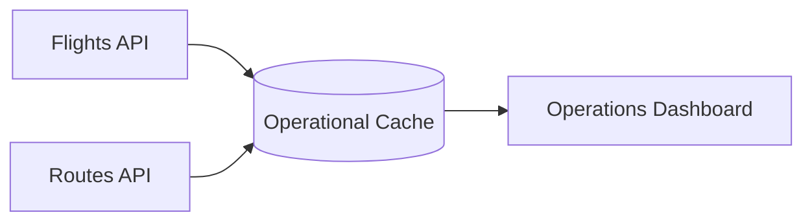

# Flight Operations

Bring together the Flights and Routes APIs to deliver real-time operational
insights for crews and travelers.

::snippet
---
name: "kongair-page-toc"
---
::

## Architecture

1. Poll `GET /flights` every 5 minutes for the target travel day.
2. Cache results in your operations data store (e.g., Redis or Aurora).
3. Join with `/routes` data to display route metadata and average duration.
4. Expose dashboards or send alerts when a flight is missing from the schedule.

## Key Considerations

- Respect rate limits by reusing cached data and only refreshing when a flight's
  scheduled time is within 2 hours of departure.
- Use the `hostname` response header to monitor the upstream node serving your
  requests.
- Store raw API responses for 7 days to support post-incident analysis.

## Go Further

- Integrate the [Real-time Booking Updates](./booking-automation/real-time-updates)
  guide to monitor passenger load factors alongside schedules.
- Publish the combined data set as an internal API to support downstream teams.
